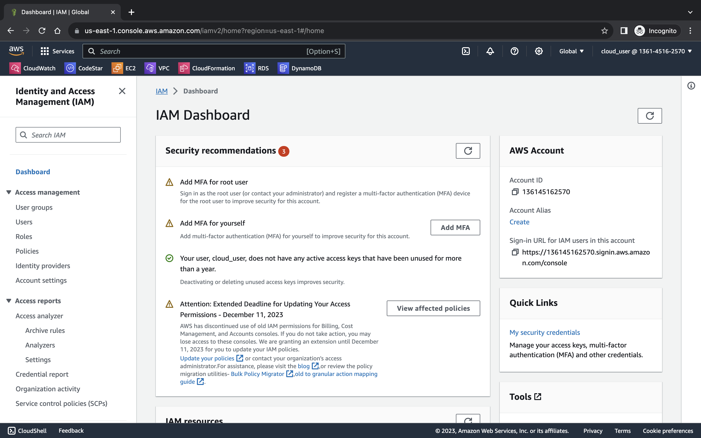
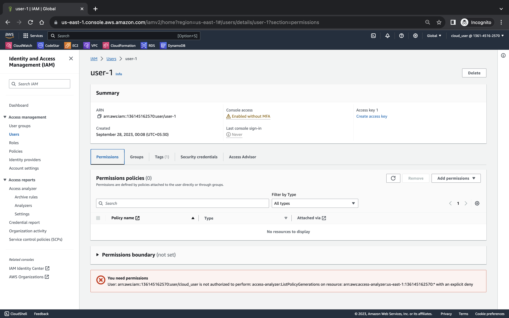
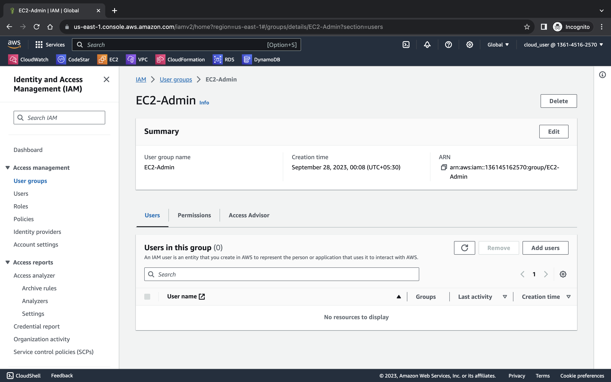
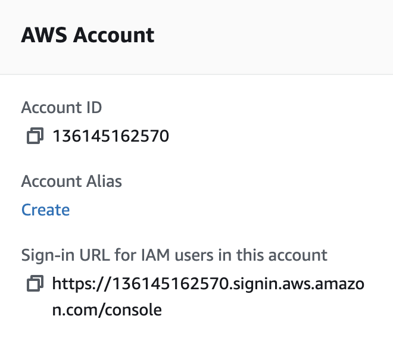

# Introduction to AWS Identity and Access Management (IAM)

> Log into your AWS console and search for IAM and you'll get a page like this..

To see your created users head over to the users section on left menu.

Now take a look at user (user-1 in my case).

This page includes it's summary with ARN(Amazon Resourse Name) and the time it was created.

> Security Credentials shows different access this user might have.
> Access Adviser will tell us what services this user has accessed and the last time they accessed it.

Now head over to the user groups section.

> An IAM user group is a collection of IAM users. User groups let you specify permissions for multiple users, which can make it easier to manage the permissions for those users.

In user groups head over to any user-group(EC2-admin in my case).

Now it will show you what users are attached to that group and you can also see what permissions does this user group give access to.

### Adding users to user groups -

To add a user to a groups click add user button and select which user you want to add.

And now that gives that user all the permissions associated with that user group.

#### Explicit Deny in IAM policies :

> When a request is made, the AWS service decides whether a given request should be allowed or denied. The default option is that all requests are denied which is called "implicit deny". This option can be overridden by an allow which is called "explicit allow". On the other hand if a policy explicitly denies a request that is called "explicit deny" and that deny can't be overridden.

#### Logging in as users created by you :

To login go to the dashboard of your main account and copy the url and paste it in a browser and sign in with the creadentials you got when you created the users.
