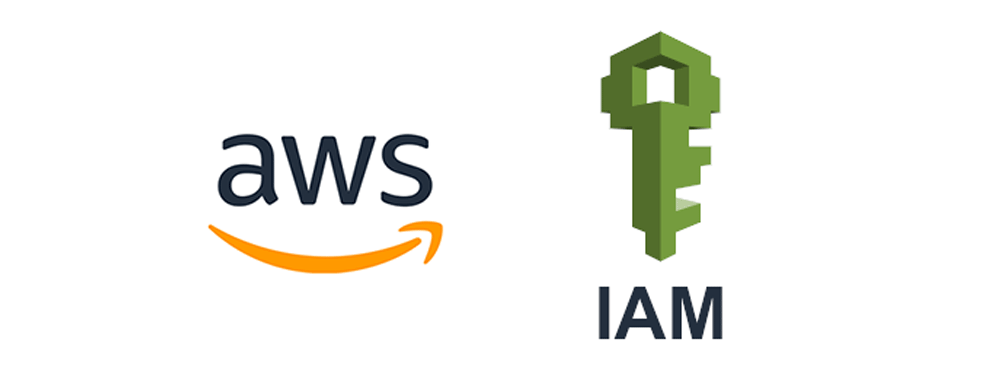
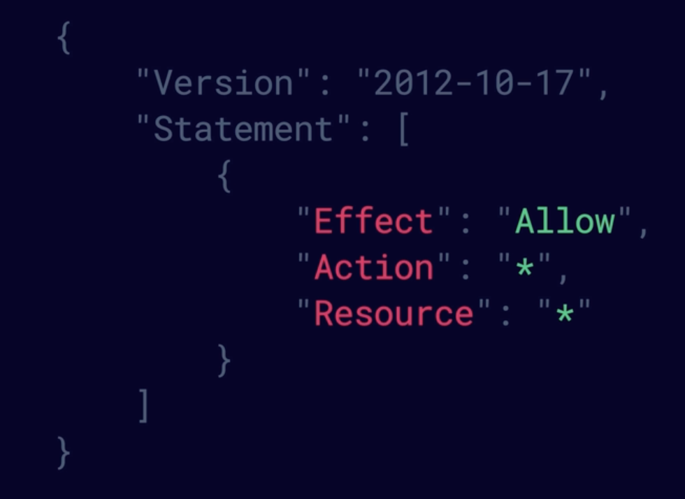
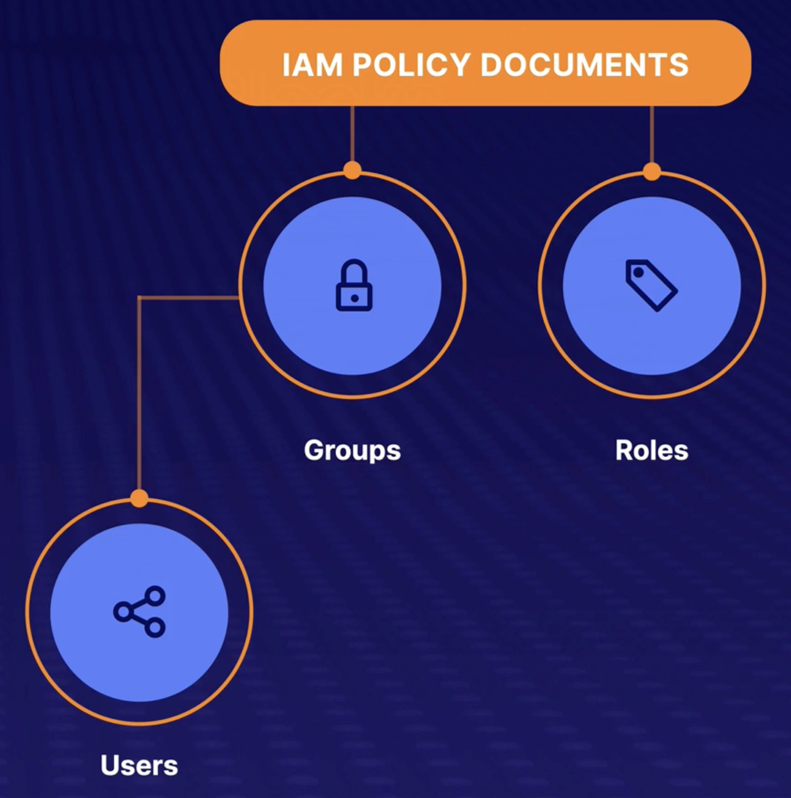

# What is IAM ?

### IAM allows you to manage users and their level of access to the AWS console.

- Create users and grant permissions to those users.
- Create groups and roles.
- Control access to AWS resources.

## What is root account ? 
The root account is the email address you used to sign up for AWS. The root account has full administrative access to AWS. **For this reason, it is important to secure this account**.

## 4 Steps to Secure Your AWS Root Account.
- Enable multi-factor authentication on the root account.
- Create an admin group for your administrators, and assign the appropriate permissions to this group.
- Create user accounts for your administrators.
- Add your users to the admin group.

## How do we control permissions ?
We assign permissions using policy documents , which are made of JSON(**JavaScript Object Notation**).

*Example of a Policy Document:*

**`IAM` is Universal*

**User has no permission when first created*

*Access ID and secret keys aren’t the same as username and passwords. And only get to see them once , so save them in a secure location.

*Always set up password rotations & you can create and customize your own rotation policies.

## The Building Blocks of IAM : 
`User` :  A physical person.

`Groups` : Fuctions such as administrator, developer, etc. Contains users.

`Roles` : Internal usage within AWS.

> It's best practice for users to *inherit permissions* from groups. And that’s because if you didn’t then it would harder to manage people individually.

> Always work on the principle that one user equals one physical person. Never share user accounts across multiple people.

## The principle of least privilege : 
Only assign user the **minimum** amount of privileges they need to do their job.

