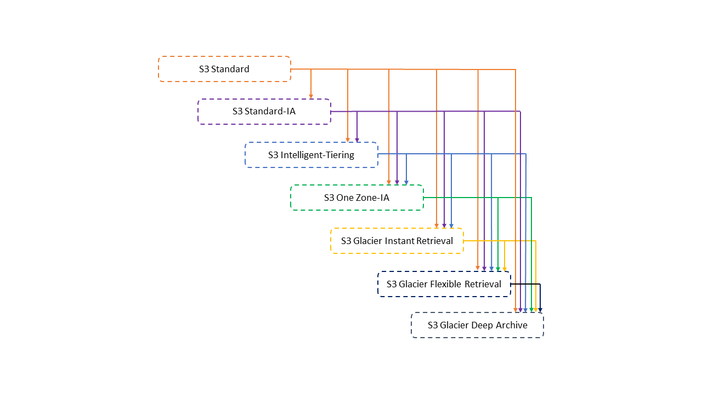
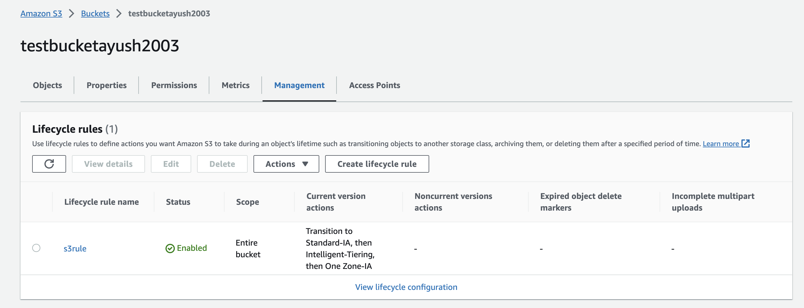

# S3 Lifecycle Management
You can add rules in an S3 Lifecycle configuration to tell Amazon S3 to transition objects to another Amazon S3 storage class.
*Thereby maximizing cost effectiveness.*

## Supported lifecycle transitions - 
Amazon S3 supports the following lifecycle transitions between storage classes using an S3 Lifecycle configuration :

- The S3 Standard storage class to any other storage class.

- The S3 Standard-IA storage class to the S3 Intelligent-Tiering, S3 One Zone-IA, S3 Glacier Instant Retrieval, S3 Glacier Flexible Retrieval, or S3 Glacier Deep Archive storage classes.

- The S3 Intelligent-Tiering storage class to the S3 One Zone-IA, S3 Glacier Instant Retrieval, S3 Glacier Flexible Retrieval, or S3 Glacier Deep Archive storage classes.

- The S3 One Zone-IA storage class to the S3 Glacier Flexible Retrieval or S3 Glacier Deep Archive storage classes.

- The S3 Glacier Instant Retrieval storage class to the S3 Glacier Flexible Retrieval or S3 Glacier Deep Archive storage classes.

- The S3 Glacier Flexible Retrieval storage class to the S3 Glacier Deep Archive storage class.

- Any storage class to the S3 Glacier Deep Archive storage class.

## Unsupported lifecycle transitions
Amazon S3 does not support any of the following lifecycle transitions : 

- Any storage class to the S3 Standard storage class.

- Any storage class to the Reduced Redundancy Storage (RRS) class.

- The S3 Intelligent-Tiering storage class to the S3 Standard-IA storage class.

- The S3 One Zone-IA storage class to the S3 Intelligent-Tiering, S3 Standard-IA, or S3 Glacier Instant Retrieval storage classes.

> You can even combine lifecycle management with versioning and can move different versions of objects to different storage tiers.

## Applying Lifecycle Management Rules on a S3 bucket (Demo)
1. Create a bucket or you can use previously created bucket.
2. Go to your S3 bucket and turn on versioning by going into Amazon S3 > Buckets > "your bucket" > properties.
3. Now head over to Amazon S3 > Buckets > "your bucket" > Management. Click "Create Lifecycle Rule", and select what rules you'd life to apply and hit create rule.

Done. ^_^