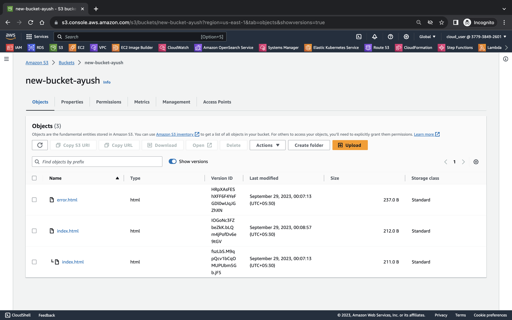

# What is versioning ?
You can enable versioning in S3 so you can have multiple versions of an object within S3.

- Contains all Versions : All versions of an object are stored in S3. This includes all writes and even if you delete an object.
- Backup : Can be a great backup tool.
- Cannot Be Disabled : Once enabled, versioning cannot be disabled — only suspended.
- Lifecycle Rules : Can be integrated with lifecycle rules.
- Supports MFA : Can support multi-factor authentication.

## Versioning demo in the AWS console - 
1. First create a S3 bucket.
2. Go to the created bucket, then head to properties then hit edit button and enable versioning.
3. Now upload your files.
4. Make a change in your uploaded file locally and reupload it again with same name.
5. Now to see your object versions , hit show versions and done.

>You'll get something like this.

>When you upload a new version of an object the previous version gets private and only new version becomes public. 

>Now to make older versions public just go to that specific version then go to object actions from top right then click make public.