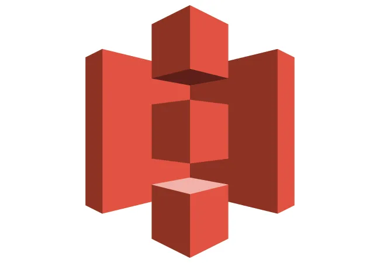

# What is S3 ? 
S3 stands for Simple Storage Service and it's a object storage in the cloud.

- **Object Storage** : S3 provides secure, durable, highly scalable object storage.
- **Scalable** : S3 allows you to store and retrieve any amount of data from anywhere on the web at a very low cost.
- **Simple** : Amazon S3 is easy to use, with a simple web service interface. 



#### S3 is object based storage - 
Which means it manages data as objects rather than in file systems or data blocks.
> Example : You can store files like photos, videos, code, documents, text files etc.
Basically you can store static files in S3. That means you can't store files like Database or Operating System.

## S3 basics
- **Object type storage** : Store files in buckets (similar to folders).
- **Can store large files** : Files can be from 0 bytes to 5 TB.
- **Can't store dynamic files** : Not suitable to install an operating system or run a database on.
- **Unlimited Storage** : The total volume of data and the number of objects you can store is unlimited.

## Working with S3 Buckets
1. **Universal Namespace** : All AWS accounts share the S3 namespace. Each S3 bucket name is globally unique.
2. **Example S3 URLs** : 
```
https://bucket-name.s3.region.amazonaws.com/key-name
https://acloudguru.s3.us-east-1.amazonaws.com/Ralphie.jpg
```    
3. **Uploading Files** : When you upload a file to an S3 bucket, you will receive an HTTP 200 code if the upload was successful.
```
As S3 works on a key value principle - 

- Key : The name of the object (e.g., Ralphie.jpg).

- Value : The data itself, which is made up of a sequence of bytes.

- Version ID : Important for storing multiple versions of the same object.

- Metadata : Data about the data you are storing (e.g., content-type, last-modified, etc).
```
### S3 is Highly available and highly durable 
- *Built for Availability* : Built for 99.95% - 99.99% service availability, depending on the S3 tier.
- *Designed for Durability* : Designed for 99.999999999% (9 decimal places) durability for data stored in S3.

## Securing your data in S3
1. *Server-Side Encryption* : You can set default encryption on a bucket to encrypt all new objects when they are stored in the bucket.
2. *Access Control Lists (ACLs)* : Define which AWS accounts or groups are granted access and the type of access. You can attach S3 ACLs to individual objects within a bucket.
3. *Bucket Policies* : S3 bucket policies specify what actions are allowed or denied (e.g., allow user Alice to PUT but not DELETE objects in the bucket).